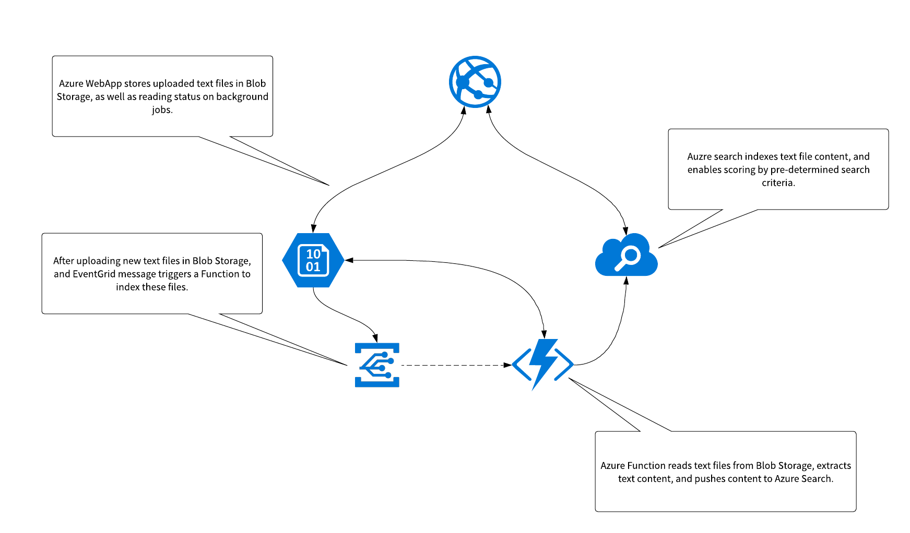

### Overview

TextFileClassifier is a sample project used to analyze text files for specific terms and then apply a classification to these files. This criteria is expressed as Azure Search queries, and can be adjusted by modifying the XXXX file (TODO). Note that this application is focused on the real-time analysis of single documents; a separate batch-process model will also be built and doc's updated once functional.

### Architecture

The following diagram represents the high-level architecture used by the solution:

